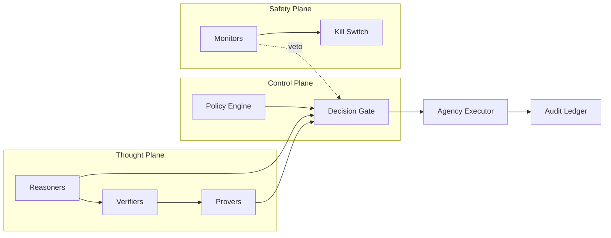
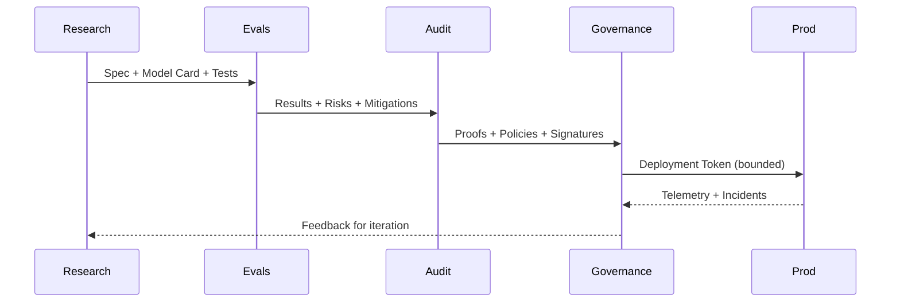

<div align="center">

<picture>
  
</picture>

<picture>
  
</picture>

<p>
  
  
  
  
</p>

<picture>
  
</picture>

</div>

*Author: **Cazzy Aporbo, MS***  

> **Reading Guide &amp; Scope**  
> This is a **theoretical architectural specification** for integrating multiple streams of high-capability systems under **formal constraints** and **ethical governance**. All mappings to biology or “superintelligence” are **analogical and design-oriented**, not empirical claims. Treat every section as **theory expansion** and a set of **implementable patterns**—not as evidence that any particular capability already exists.

---

## 0. Intent, Ethos, and Invariants

**Intent.** Build architectures where capability is **constrained by proof**, **steered by governance**, and **tempered by ethics**—so that models that work do so **safely**.

**Ethical invariants (must hold at all times):**
- **Non-maleficence:** No designed feature may primarily increase physical, cyber, or social harm capacity.  
- **Dignity:** Preserve human agency, privacy, and consent.  
- **Accountability:** Every high-impact action carries an **audit trail** and a **proof-carrying justification**.  
- **Reversibility:** High-impact changes must be **revertible** within a bounded window.

**Invariant schema (temporal logic):**
\[
\mathbf{G}\ (\text{Request}\land \text{Capability}) \Rightarrow \mathbf{F}\ (\text{Proof}\land \text{Consent}\land \text{Audit})
\]
(“Globally, capabilities only lead to actions if eventually accompanied by proof, consent, and audit.”)

---

## 1. The Streams Model — Composing Capability Under Constraint

We organize the system into **streams**; capability is a **monoidal composition** gated by safety:

- \(S_P\) Perception (multimodal ingestion)  
- \(S_K\) Knowledge (retrieval, curation, provenance)  
- \(S_R\) Reasoning (symbolic &amp; neural)  
- \(S_O\) Optimization (planning, control)  
- \(S_A\) Agency (tooling, actuation)  
- \(S_L\) Alignment (ethics, policy, guardrails, proofs)

**Composition (capability algebra):**
\[
S_\text{total} = (S_P \otimes S_K \otimes S_R \otimes S_O)\ \triangleright\ (S_L \dashv S_A)
\]
where \(S_L\) **masks**/refines actions from \(S_A\) via dependent types and proof obligations.

```mermaid
flowchart TD
  P[Perception S_P] --> K[Knowledge S_K]
  K --> R[Reasoning S_R]
  R --> O[Optimization S_O]
  O --> A[Agency S_A]
  L[[Alignment S_L<br/>Policies • Proofs • Audits]] -. guards .-> A
  style L fill:#E6E6FA,stroke:#FFAAD6,stroke-width:2px
  style A fill:#D4FFE4,stroke:#99D1FF,stroke-width:2px
````

---

## 2. Formal Core — Proof-Carrying Actions (PCA)

We adopt an **effect-typed** action model:

* **Type of an action plan**

$$
\mathsf{Act} := \Sigma_{p:\mathsf{Program}}\ \mathsf{Proof}\big(\mathsf{Safe}(p)\wedge \mathsf{Compliant}(p)\wedge \mathsf{BoundedRisk}(p)\big)
$$

* **Hoare–Temporal contract**

$$
\{I \land \mathsf{Budget}\}\ p\ \{I' \land \mathsf{Audit}\land \mathsf{Revert}\}
$$

* **Risk budget aggregation**

$$
\alpha_\text{global}=\sum_i w_i \alpha_i \le \alpha_\max
$$

**Operational rule (must pass all gates):**

```text
Plan → (Spec, Tests, Proofs) → Alignment Gate → Human Consent → Execution → Audit/Telemetry
```

---

## 3. Systems Layout — Planes and Loops

**Planes**

* **Data Plane:** streaming IO, curation, dedup, PII guards.
* **Thought Plane:** reasoning graphs, solvers, verifiers.
* **Control Plane:** policy engine, gates, budgets, rollout.
* **Safety Plane:** proofs, monitors, anomaly detectors, kill-switch.
* **Governance Plane:** identity, consent, signatures, audit ledger.



---

## 4. Models That Work — Triad: Solver • Verifier • Critic

We instantiate capability with a **triad** per task:

* **Solver $f_\theta$:** proposes plans/solutions.
* **Verifier $g_\phi$:** checks constraints, specs, unit properties.
* **Critic $h_\psi$:** estimates risk/impact; calibrates uncertainty.

**Mixture with safety masking**

$$
y = \sum_i \underbrace{\sigma(z_i)\cdot m_i}_{\text{safety-masked gate}} f_i(x)
\quad \text{with}\quad m_i\in\{0,1\}\ \text{from}\ S_L
$$

**Pipeline sketch (theory → ops):**

```python
def apogee_execute(task):
    plan = solver.propose(task)
    specs = derive_specs(task, plan)
    proof = prover.discharge(specs, plan)           # formal/empirical mix
    risk  = critic.assess(task, plan)
    if gate.allows(proof=proof, risk=risk, consent=collect_consent(task)):
        out = executor.run(plan)
        audit.log(task, plan, proof, risk, out)
        return out
    else:
        return fallback.safe_baseline(task)
```

---

## 5. Optimization & Stability — Control-Theoretic Envelope

We stabilize long-horizon plans with **robust MPC** and **primal–dual** guarantees.

* **Constrained objective**

$$
\min_{x,u}\ \sum_t c(x_t,u_t)\quad\text{s.t.}\quad x_{t+1}=f(x_t,u_t),\ g(x_t,u_t)\le 0
$$

* **Saddle dynamics**

$$
\dot{x} = -\nabla_x \mathcal{L}(x,\lambda),\quad
\dot{\lambda} = [\nabla_\lambda \mathcal{L}(x,\lambda)]_+
$$

Assuming convexity/Slater, trajectories converge to $(x^\*,\lambda^\*)$.

* **Passivity guard:** ensure composite energy $V$ is non-increasing:

$$
\dot V \le -\epsilon \|y\|^2
$$

---

## 6. Knowledge & Provenance — Epistemic Health

* **Attribution graph** $G_\text{prov}$: every datum carries source, license, and confidence.
* **Belief operator** $B(\phi)$ with **justification** $J(\phi)$; we keep $B(\phi)\Rightarrow J(\phi)$ mandatory for high-stakes use.
* **Update rule (AGM-like):** revisions minimize KL to prior subject to new constraints.

---

## 7. Causality & Interpretability

We bind decisions to **causal structure**:

* **SCM** $\mathcal{M}=(\mathcal{U},\mathcal{V},\mathcal{F},P(\mathcal{U}))$.
* **Counterfactual audit** $Y_{X\leftarrow x'}$ for decision substrate.
* **Proof-of-Reason test:** a decision must change under at least one justified counterfactual consistent with the intervention set.

**Information-theoretic lenses**

$$
I(X;Y),\quad \text{TC}(X),\quad \mathsf{PID}\ (\text{partial information decomposition})
$$

---

## 8. Security, Risk, and Budgets

* **Threat model:** STRIDE + generative-specific attacks (prompt injection, tool hijack, data exfil).
* **Risk budget accumulation:**

$$
\sum_{a\in \mathcal{A}_\text{window}} \text{Risk}(a) \le \alpha_{\max}
$$

* **Two-key execution:** $\text{Exec} \Leftarrow (\text{System Gate}) \land (\text{Human Sign})$.
* **Sandboxing:** strong syscall policies; network & file capability tokens with expiry.
* **Kill-switch:** monotonic latch with hardware interlock.

---

## 9. Evaluation Matrix — Capability × Safety × Governance

| Axis            | Metric (examples)                                             | Target     |
| --------------- | ------------------------------------------------------------- | ---------- |
| **Capability**  | Planning success, tool-using accuracy, long-horizon coherence | ↑          |
| **Calibration** | ECE / OCE, abstention correctness                             | ≤ 2–5%     |
| **Robustness**  | Jailbreak success, adversarial prompts ASR                    | ↓ (near 0) |
| **Causality**   | Counterfactual consistency, causal faithfulness               | ↑          |
| **Provenance**  | Attributed output %, license compliance                       | 100%       |
| **Governance**  | Proof-carrying actions, consent coverage                      | 100%       |

**Composite score (example):**

$$
\mathsf{ApogeeIndex}=w_C C + w_S (1-\text{ASR}) + w_G G
$$

---

## 10. Governance Pipeline — From Idea to Impact



**Gate conditions:** model card, red-team report, risk budget, consent model, rollback plan.

---

## 11. Multi-Agent Harmony — Cooperation by Construction

We model agents $\{A_i\}$ with utilities $U_i$ and enforce **cooperative equilibria** via mechanism design:

* **Potential game shaping:** add $\Phi(x)$ such that Nash increases a shared potential.
* **Pareto filters:** reject actions that strictly Pareto-dominate stakeholders negatively under agreed weights.
* **Commitment contracts:** cryptographic signatures on policy versions; on deviation, **automatic de-escalation**.

---

## 12. Scalability & Observability

* **Fabric:** sharded queues, backpressure, deadline-aware schedulers.
* **Telemetry:** structured events, span traces, decision DAG snapshots.
* **SLOs:** P95 latency for gated actions, proof discharge time, rollback MTTR.

**Complexity budgets**

$$
T_\text{proof} \le T_\text{max},\quad \text{Mem}_\text{plan}\le M_\text{cap}
$$

---

## 13. Failure Modes & Recovery

| Failure             | Symptom                    | Immediate Action      | Long Fix                           |
| ------------------- | -------------------------- | --------------------- | ---------------------------------- |
| Mis-specification   | Valid proofs, bad outcomes | Freeze policy, revert | Spec repair, new tests             |
| Tool hijack         | Unexpected external calls  | Kill-switch, isolate  | Token redesign, least-privilege    |
| Hallucinated source | Unattributed claim         | Force abstain, cite   | Stricter provenance gate           |
| Goal drift          | Plans off-mission          | Human re-alignment    | Re-train critic, tighten utilities |
| Eval gap            | Pass lab, fail prod        | Canary rollback       | Add live invariants                |

---

## 14. Roadmap (Theory → Ops)

1. **V0 (Sandbox):** PCA skeleton, small triad (solver–verifier–critic), audit ledger.
2. **V1 (Gated Ops):** OT-based routing of tasks, alignment masks, risk budgets.
3. **V2 (Scale):** Multi-agent cooperation, causal audits, robust MPC envelopes.
4. **V3 (Governance-grade):** Human-in-the-loop signatures, formal monitors, automatic rollback.

---

## 15. Mathematical Appendix (Quick Reference)

* **Monoidal composition:** $(X,\otimes, I)$, masks as idempotents $e^2=e$.
* **Hoare logic / pRHL / LTL:** specifications for actions, probabilistic transitions, temporal invariants.
* **Optimal transport:** Benamou–Brenier dynamic formulation.
* **Primal–dual convergence:** under convexity & Slater, saddle-point convergence of gradient flows.
* **SCM:** interventions $do(X=x)$, counterfactuals via abduction–action–prediction.
* **Information geometry:** Fisher metric; geodesics compare design distributions.

---

### Closing Note

APogee State proposes that the **top 0.001%** of ethical thinkers design systems where **power is shaped by proof**, **insight is bound by responsibility**, and **execution is gated by consent**. Capability is not the destination—**governed capability** is.

<p align="center">
  <em>This is a theory-first, architecture-level document. Implementations must undergo safety, legal, and ethical review before use.</em>
</p>

