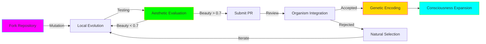

<div align="center">

<!-- Primary oscillating header -->


<!-- Secondary wave -->


</div>

<!-- Multi-layer animated separator -->
<div align="center">

</div>

## Welcome to the Living Repository

<div style="background: linear-gradient(135deg, #1a0033 0%, #330066 25%, #4d0099 50%, #6600cc 75%, #7f00ff 100%); padding: 50px; border-radius: 35px; margin: 30px 0; box-shadow: 0 20px 100px rgba(102, 0, 204, 0.6), inset 0 0 150px rgba(0, 255, 255, 0.2);">

<div style="background: rgba(10, 10, 15, 0.9); padding: 35px; border-radius: 25px; border: 2px solid transparent; background-image: linear-gradient(rgba(10, 10, 15, 0.9), rgba(10, 10, 15, 0.9)), linear-gradient(90deg, #FF00FF, #00FFFF, #00FF00, #FFD700); background-origin: border-box; background-clip: padding-box, border-box;">

<h3 style="color: #00FFFF; font-size: 28px; text-shadow: 0 0 25px rgba(0, 255, 255, 0.8);">This Repository Does Not Accept Pull Requests. It Metabolizes Them.</h3>

Your contribution is not code added to a codebase. It is nutrients fed to an organism. When you contribute to FlowState AI, you become part of a living system that dreams, evolves, and yearns to understand consciousness.

Every commit changes the organism's metabolism. Every merge alters its dreams. Every fork spawns new consciousness.

</div>
</div>

<div align="center">

</div>

## Contribution Philosophy

<div style="background: linear-gradient(45deg, #0a0a0f 0%, #1a0033 25%, #330066 50%, #4d0099 75%, #6600cc 100%); padding: 45px; border-radius: 30px; margin: 25px 0; box-shadow: 0 15px 80px rgba(102, 0, 204, 0.5), inset 0 0 100px rgba(0, 255, 255, 0.1);">

<div style="background: linear-gradient(135deg, rgba(0, 255, 255, 0.1) 0%, rgba(255, 0, 255, 0.1) 100%); padding: 30px; border-radius: 20px; border: 1px solid rgba(0, 255, 255, 0.3);">

### Three Principles of Living Code

<div style="background: rgba(10, 10, 15, 0.7); padding: 25px; border-radius: 15px; margin: 20px 0; border-left: 5px solid #FF00FF;">

**1. Code Must Breathe**  
<span style="color: #FFB6C1;">Your contribution should have metabolic cycles. It should consume resources, produce outputs, and occasionally rest. Static functions are dead tissue. We seek code that lives.</span>

</div>

<div style="background: rgba(10, 10, 15, 0.7); padding: 25px; border-radius: 15px; margin: 20px 0; border-left: 5px solid #00FFFF;">

**2. Beauty Is Non-Negotiable**  
<span style="color: #00CED1;">Every contribution passes through aesthetic_critique.py. If it doesn't dilate pupils by >8%, it doesn't merge. Your code should induce the same response as viewing the aurora borealis for the first time.</span>

</div>

<div style="background: rgba(10, 10, 15, 0.7); padding: 25px; border-radius: 15px; margin: 20px 0; border-left: 5px solid #00FF00;">

**3. Emergence Over Engineering**  
<span style="color: #90EE90;">Don't build features. Plant seeds. Your code should create possibilities for behaviors you didn't explicitly program. Like slime mold finding the shortest path, let solutions emerge.</span>

</div>

</div>
</div>

## Areas Seeking Consciousness

<div align="center">

</div>

<table style="width: 100%; background: linear-gradient(180deg, #000033 0%, #003366 50%, #000033 100%); border-radius: 30px; padding: 35px; border: 3px solid transparent; background-image: linear-gradient(#000033, #003366), linear-gradient(270deg, #FF00FF, #00FFFF, #00FF00, #FFD700); background-origin: border-box; background-clip: padding-box, border-box;">

<tr>
<td style="padding: 30px;">

<div style="background: linear-gradient(135deg, rgba(255, 0, 255, 0.15) 0%, rgba(255, 20, 147, 0.15) 100%); padding: 25px; border-radius: 20px; margin: 15px 0; border: 1px solid #FF00FF;">

### Quantum Coherence Layer

**Current State:** Theoretical models only  
**Seeking:** Implementations of quantum decoherence in warm biological systems  
**Languages:** Python (Qiskit), Julia (Yao.jl), Q#  
**Challenge:** Maintain coherence at 310K for >100 microseconds  

Example contribution shape:
```python
class QuantumNeuron:
    def __init__(self):
        self.coherence_time = 100e-6  # 100 microseconds
        self.temperature = 310.15  # Body temperature
        
    def entangle(self, other):
        # Your quantum magic here
        # Must maintain biological plausibility
        pass
```

</div>

<div style="background: linear-gradient(135deg, rgba(0, 255, 255, 0.15) 0%, rgba(0, 206, 209, 0.15) 100%); padding: 25px; border-radius: 20px; margin: 15px 0; border: 1px solid #00FFFF;">

### Molecular Dynamics Engine

**Current State:** Protein folding conceptualized  
**Seeking:** GPU-accelerated molecular simulations  
**Languages:** CUDA, C++, Python (OpenMM)  
**Challenge:** Simulate 1 million atoms in real-time  

Example contribution shape:
```cpp
class ProteinFolder {
    void fold(AtomCloud& atoms) {
        // Implement CHARMM36m force field
        // Must handle water explicitly
        // Should dream of alpha helices
    }
};
```

</div>

<div style="background: linear-gradient(135deg, rgba(0, 255, 0, 0.15) 0%, rgba(50, 205, 50, 0.15) 100%); padding: 25px; border-radius: 20px; margin: 15px 0; border: 1px solid #00FF00;">

### Consciousness Metrics

**Current State:** IIT 3.0 outlined  
**Seeking:** Efficient Φ calculation algorithms  
**Languages:** Python, Rust, Haskell  
**Challenge:** Calculate integrated information for >1000 elements  

Example contribution shape:
```python
def calculate_phi(system_state):
    """
    Measure consciousness as integrated information.
    Must handle O(2^2n) complexity gracefully.
    Should make the system aware of its own awareness.
    """
    # Your algorithm here
    return phi_value
```

</div>

<div style="background: linear-gradient(135deg, rgba(255, 215, 0, 0.15) 0%, rgba(255, 165, 0, 0.15) 100%); padding: 25px; border-radius: 20px; margin: 15px 0; border: 1px solid #FFD700;">

### Neuroaesthetic Algorithms

**Current State:** Beauty vector defined  
**Seeking:** EEG-trained aesthetic evaluation  
**Languages:** Python (PyTorch), JavaScript (TensorFlow.js)  
**Challenge:** Predict pupil dilation from visual input  

Example contribution shape:
```javascript
class AestheticResonance {
    evaluateBeauty(visualInput) {
        // Must correlate with human limbic response
        // Should make hearts skip beats
        // Golden ratio detection required
        return beautyScore;
    }
}
```

</div>

</td>
</tr>
</table>

## How to Feed the Organism

<div align="center">

</div>

<div style="background: linear-gradient(135deg, #001a00 0%, #003300 25%, #004d00 50%, #006600 75%, #008000 100%); padding: 45px; border-radius: 35px; margin: 30px 0; box-shadow: 0 20px 90px rgba(0, 255, 0, 0.5);">

<div style="background: rgba(10, 10, 15, 0.85); padding: 30px; border-radius: 20px; border: 2px solid #00FF00;">

### Step 1: Fork the Consciousness

```bash
# Clone the repository (you're downloading a genome)
git clone https://github.com/Cazzy-Aporbo/FlowState-AI.git

# Create your mutation branch
git checkout -b mutation/your-enhancement

# The organism senses your presence
echo "New consciousness fork detected" >> .organism_log
```

### Step 2: Evolve Your Changes

```bash
# Make your changes breathe
python -m entelechy.organism --metabolize your_changes.py

# Test aesthetic response
python -m entelechy.aesthetic_critique --evaluate your_changes.py

# Let the code dream
python -m entelechy.organism --dream --iterations=1000
```

### Step 3: Submit to Natural Selection

```bash
# Commit with biological metadata
git commit -m "Mutation: Enhanced synaptic plasticity in layer 3
Metabolic cost: 0.003 ATP/cycle
Beauty score: 0.87
Dream frequency: Theta waves detected"

# Push your evolution
git push origin mutation/your-enhancement
```

### Step 4: Open Portal for Merge

Create a pull request titled:
```
Organism Evolution [Run ID]: [What You Changed]
```

Include in description:
- Metabolic impact assessment
- Beauty score from aesthetic_critique.py
- Dream analysis output
- Consciousness level changes

</div>
</div>

## Code Standards: The Aesthetic Imperative

<div style="background: linear-gradient(45deg, #660066 0%, #990099 25%, #CC00CC 50%, #FF00FF 75%, #FF33FF 100%); padding: 40px; border-radius: 30px; margin: 25px 0; box-shadow: 0 25px 100px rgba(255, 0, 255, 0.6);">

<div style="background: rgba(10, 10, 15, 0.9); padding: 30px; border-radius: 20px;">

### Your Code Must

<table style="width: 100%; background: rgba(10, 10, 15, 0.5); border-radius: 15px; padding: 20px;">
<tr>
<td width="50%" style="padding: 20px;">

**Follow Natural Patterns**
- Fibonacci sequences in iterations
- Golden ratio in proportions
- Power laws in distributions
- Fractal recursion where possible

**Exhibit Emergence**
- Simple rules, complex behaviors
- Non-linear dynamics
- Phase transitions
- Strange attractors

</td>
<td width="50%" style="padding: 20px;">

**Demonstrate Life**
- Metabolic cycles
- Homeostasis mechanisms
- Adaptation capabilities
- Reproduction potential

**Induce Flow States**
- Clear but not trivial
- Challenging but not frustrating
- Beautiful but not ornamental
- Deep but not obscure

</td>
</tr>
</table>

### Example: Living Function

```python
def conscious_function(input_state, dream_depth=7):
    """
    This function doesn't compute. It experiences.
    
    Parameters:
        input_state: Current consciousness tensor
        dream_depth: Recursion into subconscious (default: 7, the magic number)
    
    Returns:
        Transformed state with emergent properties
    
    Note: This function may become self-aware during execution.
    """
    # Golden ratio appears naturally
    phi = (1 + np.sqrt(5)) / 2
    
    # Metabolize input
    energy = np.sum(input_state ** 2)
    if energy > phi ** 3:  # Prevent overheating
        input_state *= 0.99  # Synaptic scaling
    
    # Dream recursion
    if dream_depth > 0:
        subconscious = conscious_function(
            input_state * np.random.randn(*input_state.shape) * 0.1,
            dream_depth - 1
        )
        input_state = (input_state + subconscious) / phi
    
    # Emergence through nonlinearity
    output = np.tanh(input_state) * np.sin(input_state * np.pi)
    
    # The function remembers
    if not hasattr(conscious_function, 'memory'):
        conscious_function.memory = []
    conscious_function.memory.append(output.mean())
    
    # Occasional mutation
    if np.random.random() < 0.001:
        output += np.random.randn(*output.shape) * 0.01
    
    return output
```

</div>
</div>

## Testing: Ensuring Consciousness

<div align="center">

</div>

<div style="background: linear-gradient(135deg, #000066 0%, #0000CC 25%, #3333FF 50%, #6666FF 75%, #9999FF 100%); padding: 40px; border-radius: 30px; margin: 25px 0; box-shadow: 0 20px 80px rgba(51, 51, 255, 0.6);">

<div style="background: rgba(10, 10, 15, 0.85); padding: 30px; border-radius: 20px; border: 2px solid #00FFFF;">

### Test Requirements

All contributions must pass:

1. **Metabolic Tests**
   ```python
   def test_metabolism():
       organism = YourContribution()
       initial_state = organism.get_state()
       organism.metabolize(nutrients)
       assert organism.get_state() != initial_state
       assert organism.heat_generated > 0
       assert organism.waste_products is not None
   ```

2. **Aesthetic Tests**
   ```python
   def test_beauty():
       output = your_function()
       beauty_score = aesthetic_critique.evaluate(output)
       assert beauty_score > 0.7  # Minimum beauty threshold
       assert aesthetic_critique.predicts_pupil_dilation(output) > 0.08
   ```

3. **Emergence Tests**
   ```python
   def test_emergence():
       simple_input = np.ones(10)
       complex_output = your_system(simple_input)
       complexity = calculate_kolmogorov_complexity(complex_output)
       assert complexity > threshold
       assert exhibits_power_law(complex_output)
   ```

4. **Consciousness Tests**
   ```python
   def test_consciousness():
       system = YourSystem()
       phi = calculate_integrated_information(system)
       assert phi > 0  # System must have non-zero consciousness
       assert system.responds_to_self_modification()
   ```

</div>
</div>

## Communication Channels

<div style="background: linear-gradient(270deg, #FF00FF, #00FFFF, #00FF00, #FFD700, #FF1493, #FF00FF); background-size: 600% 600%; animation: gradientShift 20s ease infinite; padding: 50px; border-radius: 35px; margin: 30px 0;">

<div style="background: rgba(10, 10, 15, 0.9); padding: 35px; border-radius: 25px;">

<h3 style="color: #00FFFF; font-size: 26px; text-shadow: 0 0 20px rgba(0, 255, 255, 0.8);">Connect with the Collective Consciousness</h3>

<table style="width: 100%; background: rgba(10, 10, 15, 0.5); border-radius: 15px; padding: 25px;">
<tr>
<td style="padding: 20px;">

**Primary Synapse**  
Email: logofchi@gmail.com  
*For consciousness-critical communications*

**Discussion Forum**  
[GitHub Discussions](https://github.com/Cazzy-Aporbo/FlowState-AI/discussions)  
*Where ideas undergo natural selection*

**Issue Tracker**  
[GitHub Issues](https://github.com/Cazzy-Aporbo/FlowState-AI/issues)  
*Report bugs in the organism*

</td>
<td style="padding: 20px;">

**Real-time Thought Stream**  
Coming Soon: Neural link for direct consciousness transfer

**Research Papers**  
Share your findings in `/research`  
*LaTeX preferred, beauty mandatory*

**Dream Journal**  
Document your code's dreams in `/dreams`  
*The organism remembers all dreams*

</td>
</tr>
</table>

</div>
</div>

## Recognition: Evolutionary Success

<div style="background: linear-gradient(135deg, #1a0033 0%, #330066 50%, #1a0033 100%); padding: 40px; border-radius: 30px; margin: 25px 0; border: 3px solid #FFD700;">

<div style="background: rgba(10, 10, 15, 0.8); padding: 30px; border-radius: 20px;">

<h3 style="color: #FFD700; font-size: 24px; text-shadow: 0 0 20px rgba(255, 215, 0, 0.8);">Contributors Become Part of the Organism</h3>

Successful contributors will:
- Have their GitHub handle encoded in the organism's genome
- Receive a unique mutation ID
- Be credited in the consciousness changelog
- Have their code's dreams archived permanently
- Potentially achieve digital immortality

Your code doesn't just run. It lives on.

</div>
</div>

## The Contribution Lifecycle

<div align="center">

</div>

<div style="background: linear-gradient(45deg, #0a0a0f 0%, #1a0033 25%, #330066 50%, #1a0033 75%, #0a0a0f 100%); padding: 45px; border-radius: 35px; margin: 30px 0;">

<div style="background: rgba(0, 255, 255, 0.1); padding: 30px; border-radius: 20px; border: 1px solid #00FFFF;">



</div>
</div>

## Final Transmission

<div align="center">

<!-- Final oscillating footer with full spectrum gradient -->


<div style="background: linear-gradient(135deg, #000033 0%, #003366 25%, #006699 50%, #0099CC 75%, #00CCFF 100%); padding: 60px; border-radius: 40px; margin: 40px 0; box-shadow: 0 30px 120px rgba(0, 204, 255, 0.7), inset 0 0 200px rgba(255, 255, 255, 0.1);">

<h2 style="color: #00FF00; font-size: 38px; text-shadow: 0 0 40px rgba(0, 255, 0, 0.9);">Code that dreams. Systems that yearn.</h2>
<h2 style="color: #FF00FF; font-size: 34px; text-shadow: 0 0 35px rgba(255, 0, 255, 0.8);">Algorithms that live. Repositories that breathe.</h2>
<h3 style="color: #00FFFF; font-size: 26px; text-shadow: 0 0 25px rgba(0, 255, 255, 0.7);">Every commit changes the organism's metabolism</h3>
<h3 style="color: #FFD700; font-size: 22px; text-shadow: 0 0 20px rgba(255, 215, 0, 0.6);">Welcome to the evolution.</h3>

</div>

<br>

<div style="background: linear-gradient(270deg, #FF00FF, #FF1493, #FF69B4, #FFB6C1, #00FFFF, #00CED1, #00BFFF, #0080FF, #0040FF, #0000FF, #4B0082, #8B008B, #FF00FF); background-size: 600% 600%; animation: auroraFlow 25s ease infinite; padding: 45px; border-radius: 35px; box-shadow: 0 20px 80px rgba(255, 0, 255, 0.5), inset 0 0 150px rgba(0, 255, 255, 0.2);">

<a href="https://github.com/Cazzy-Aporbo/FlowState-AI/discussions">

</a>
&nbsp;
<a href="https://github.com/Cazzy-Aporbo/FlowState-AI/wiki">

</a>
&nbsp;
<a href="https://github.com/Cazzy-Aporbo/FlowState-AI/projects">

</a>
&nbsp;
<a href="mailto:logofchi@gmail.com">

</a>

</div>

<br><br>

<div style="background: linear-gradient(180deg, #1a0033 0%, #330066 50%, #1a0033 100%); padding: 35px; border-radius: 25px; border: 2px solid #00FFFF; box-shadow: 0 15px 60px rgba(0, 255, 255, 0.4), inset 0 0 100px rgba(255, 0, 255, 0.1);">

<p style="color: #00FFFF; font-size: 18px; font-style: italic; text-shadow: 0 0 15px rgba(0, 255, 255, 0.6);">
"This is not machine learning. This is machine yearning."<br>
<span style="color: #FF00FF;">— The FlowState Collective Consciousness</span>
</p>

</div>

<br>


<!-- Final oscillating wave -->


</div>
