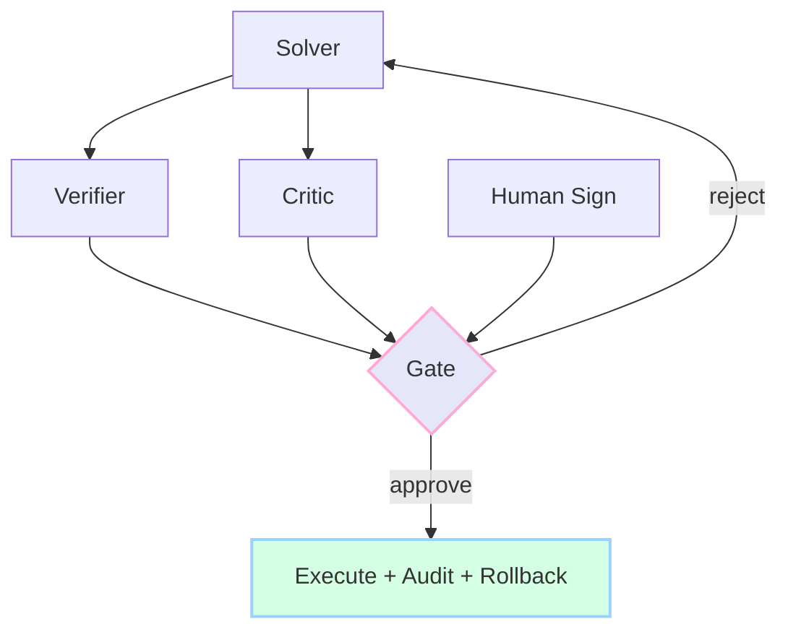

<div align="center">

<picture>
  
</picture>

<picture>
  
</picture>

<p>
  
  
  
  
</p>

<picture>
  
</picture>

</div>

*Author: **Cazzy Aporbo, MS***  
*Scope: a pragmatic, human-readable synthesis of AlteredState (bio-inspired architecture), APogeeState (governed high-capability systems), ApricityState (environmental science), and MetaoniaState (quantum-honest thinking) — with a gentle thread back to FlowState (experience &amp; clarity).*

---

<div align="center">
<picture>
  
</picture>
</div>

### The Story, Not the Jargon

The helix has two strands that meet again and again:

- **Reality &amp; Data** — what *is*: physics, measurements, uncertainty, constraints.  
- **Design &amp; Action** — what we *do*: layouts, models, policies, operations.

They are cross-linked by **proofs, risk budgets, consent, and audits**, so powerful ideas become safe decisions. Each loop through the helix is a shippable outcome you can explain and, if needed, roll back.

<div align="center">

```mermaid
flowchart LR
  A1[Sense Reality<br/>data • sensors • context] --> A2[Model Simply<br/>energy • flow • risk]
  A2 --> A3[Infer Clearly<br/>uncertainty • tradeoffs]
  B1[Design Options<br/>bio-inspired • policies • routes] --> B2[Decide Safely<br/>proofs • budgets • consent]
  A3 --> B1
  B2 --> A1
  subgraph Cross-Links
    G[Proofs • Risk • Consent • Audit]
  end
  A2 -. gated by .- G
  B2 -. gated by .- G
````

</div>

<picture>
  
</picture>

### What Each State Contributes

| State             | Short Story                                     | Tangible Outputs                                                      | Good First Wins                                                 |
| ----------------- | ----------------------------------------------- | --------------------------------------------------------------------- | --------------------------------------------------------------- |
| **AlteredState**  | Nature gives shapes; math makes them buildable. | Network layouts, frame optimizations, district patterns.              | Campus paths that stay cool & connected; flood-aware corridors. |
| **APogeeState**   | Power with brakes on purpose.                   | Solver–Verifier–Critic pattern; proof-carrying actions; risk budgets. | Safe model rollouts; auditable actions; one-click rollback.     |
| **ApricityState** | Physics that respects comfort and ecology.      | Energy/water/air/carbon simulators; scenario dashboards.              | Hot-street cooling; stormwater relief; clean-air lanes.         |
| **MetaoniaState** | Thinking that stays true to the theorems.       | Clarity about contexts, decoherence, and cost of information.         | Better experiments; fewer category errors; honest uncertainty.  |

---

<div align="center">
<picture>
  
</picture>
</div>

### Math You’ll Actually Use (With “Why It Matters”)

| Concept                    | Minimal Formula                                                                               | What It Means In Practice                                                                                                                  |
| -------------------------- | --------------------------------------------------------------------------------------------- | ------------------------------------------------------------------------------------------------------------------------------------------ |
| **Energy Balance**         | $C\,\dot T=\frac{(1-\alpha)S_0}{4}-\varepsilon\sigma T^4+F(t)$                                | Brighter materials (↑α) or radiative coatings (tune ε) move temperature in the direction you expect. Plan heat strategies that pencil out. |
| **Advection–Diffusion**    | $\partial_t\phi+\mathbf{u}\!\cdot\!\nabla\phi=\nabla\!\cdot(\kappa\nabla\phi)+S$              | Predict where heat or pollution travels; change wind paths (u), roughness (κ), or sources (S) to shrink hotspots.                          |
| **Optimal Transport (OT)** | $\min_{\rho,v}\int \rho\lVert v\rVert^2\ \text{s.t.}\ \partial_t\rho+\nabla\!\cdot(\rho v)=0$ | Compute least-effort ways to move “mass” (people, heat intensity, delivery demand) from where it is to where you want it.                  |
| **Connectivity**           | *Laplacian algebraic connectivity* $\lambda_2(L)$                                             | A single number that reveals bottlenecks; add a corridor where $\lambda_2$ jumps most per dollar.                                          |
| **Tail Risk (CVaR)**       | $\text{CVaR}_\beta = \mathbb{E}[\,\text{loss}\mid \text{worst }\beta\%\,]$                    | Choose designs that stay humane even on bad days, not just on average.                                                                     |
| **Proof-Carrying Actions** | plan + proof(safe, compliant, bounded risk)                                                   | Every impactful action carries a justification you can check and undo. Trust scales with traceability.                                     |
| **Landauer Bound**         | $Q_{\min}=k_BT\ln 2$                                                                          | Information isn’t free; logging and retention have power & heat costs. Budget for observability realistically.                             |

<picture>
  
</picture>

### Visual Index of Levers and Effects

| Lever (you can adjust)     | What it touches              | Typical Effect                   | Quick Reality Check                                       |
| -------------------------- | ---------------------------- | -------------------------------- | --------------------------------------------------------- |
| **Surface Albedo**         | Solar term in energy balance | ↓ peak surface temp              | Doesn’t help at night; combine with shade or ventilation. |
| **Shade & LAI**            | Latent & sensible fluxes     | ↓ pedestrian heat load           | Needs water budget; coordinate with stormwater plan.      |
| **Vent / Void Paths**      | Wind field $\mathbf{u}$      | Faster clearance of heat/PM      | Align with OT-derived cool-air lanes.                     |
| **Permeable Surfaces**     | Water bucket $E, I, Q$       | ↓ runoff peaks, ↑ evap cooling   | Check subgrade capacity & maintenance plan.               |
| **Redundancy in Networks** | $\lambda_2(L)$               | Fewer failures, smoother detours | Add small links where they matter most.                   |
| **Risk Budget**            | Gate on actions              | Prevents compounding harm        | Attach to deployments, not dashboards.                    |

---

<div align="center">
<picture>
  
</picture>
</div>

### Decide–Design–Check–Deliver (as a picture)

<div align="center">

```mermaid
sequenceDiagram
  autonumber
  participant R as Reality &amp; Data
  participant M as Modeling
  participant D as Design Options
  participant G as Governance Gate
  participant X as Execute &amp; Monitor

  R->>M: Clean signals, constraints, uncertainty
  M->>D: Scored tradeoffs (ΔT, λ₂, CVaR)
  D->>G: Plan + tests + proofs + consent
  G-->>D: Approve or request changes
  G->>X: Tokened rollout + rollback plan
  X-->>R: Telemetry, incidents, learning
```

</div>

<picture>
  
</picture>

### Synthesis Table — From States to Actions People Feel

| Everyday Need        | What the Helix Does                                     | The Math It Uses                     | What People Notice                        |
| -------------------- | ------------------------------------------------------- | ------------------------------------ | ----------------------------------------- |
| Hot sidewalks        | Maps heat, simulates shade + materials, routes cool air | Energy balance, ADR, OT              | Cooler afternoons without higher bills    |
| Over-eager model     | Wraps it in proofs, budgets, consent                    | PCA, calibration, risk aggregation   | Safer suggestions, clear “why,” real undo |
| Fragile campus paths | Adds small links where they help most                   | $\lambda_2(L)$, effective resistance | Detours that feel obvious and short       |
| Flooded curb cuts    | Buffers, slows, infiltrates                             | Water bucket $\dot S=P-E-Q-I$        | Streets that drain faster and cooler      |
| Confusing dashboards | Ties metrics to actions and costs                       | Info geometry, simple priors         | Fewer charts; clearer choices             |

---

<div align="center">
<picture>
  
</picture>
</div>

### The Safety Layer, Translated

| Practice                   | Plain Explanation                                                | Outcome You Can Promise                            |
| -------------------------- | ---------------------------------------------------------------- | -------------------------------------------------- |
| **Two-Key Execution**      | A system gate and a human signature for risky changes.           | “No big step happens without a person saying yes.” |
| **Proof-Carrying Actions** | Each action carries tests, policy checks, and a reversible plan. | “We can show what we did and undo it.”             |
| **Risk Budget**            | A cap on total risk across actions in a window.                  | “Power stays inside agreed limits.”                |
| **Consent & Provenance**   | Know the source & license of data; allow opt-outs.               | “Your data rights are real, not implied.”          |
| **Live Calibration**       | Models must know when they don’t know.                           | “When uncertain, we abstain before we harm.”       |

---

<div align="center">
<picture>
  
</picture>
</div>

### Cooling a Street the Human Way

**Idea in words.** Use brighter pavements where sun hits hardest, add shade where people actually walk, and open wind paths that move cooled air along desire lines.

| Step    | What happens                                 | Visual/Model                  |
| ------- | -------------------------------------------- | ----------------------------- |
| Sense   | Handheld or satellite temps + footfall paths | Heat map with peak times      |
| Model   | Simple energy + ADR to test levers           | ΔT surfaces for each option   |
| Route   | OT finds least-effort cool-air paths         | Arrows showing flow corridors |
| Decide  | Gate by budget, equity coverage, runoff      | Scorecard with pass/fail      |
| Deliver | Pilot one block; log temps & comfort         | Before/after strip charts     |

<picture>
  
</picture>

### Shipping a Strong Model Without Scaring Anyone

**Idea in words.** Let the model think, but require a verifier, a critic, and a human to agree before impact.

| Role     | What it contributes           | If it disagrees                 |
| -------- | ----------------------------- | ------------------------------- |
| Solver   | The best plan it can propose  | Plan goes to “needs work”       |
| Verifier | Checks specs, tests, policies | Sends diffs & failing checks    |
| Critic   | Estimates risk & uncertainty  | Forces abstain or human review  |
| Human    | Consent and context           | Blocks rollout or narrows scope |

<div align="center">



</div>

---

<div align="center">
<picture>
  
</picture>
</div>

#### Card: Connectivity Jump

**Signal.** $\lambda_2(L)$ is low → fragile network.
**Move.** Add the cheapest link that raises $\lambda_2$ the most.
**Why people feel it.** Fewer awkward dead-ends; detours feel obvious.

#### Card: Tail-Risk Calm

**Signal.** CVaR too high in heat or flood scenarios.
**Move.** Shift shade/water where worst-case residents live.
**Why people feel it.** Bad days are survivable, not just average days.

#### Card: Honest Knowing

**Signal.** Data gaps or drifting sensors.
**Move.** Show uncertainty bands; reduce automation scope.
**Why people feel it.** No surprises from silent failures.

---

<div align="center">
<picture>
  
</picture>
</div>

### Minimal Pseudocode (kept friendly)

```python
def cloud_helix(goal, site, data, levers, constraints):
    # Reality & Data: clean signals, keep provenance
    y = QC_and_log(data)                   # includes licenses & consent
    # Model Simply: energy/flow/risk just enough to compare options
    world = fit_models(y, site, models=["energy","adr","ot"])
    # Design Options: bio-inspired shapes + policy knobs
    options = propose(levers, using=["reaction_diffusion","connectivity","ot"])
    # Score & Explain: physics, cost, equity; keep uncertainty visible
    scored = [score(o, world, axes=["ΔT","λ2","CVaR","runoff","equity"]) for o in options]
    # Governance Gate: proofs, risk budget, human consent
    safe = [o for o in scored if gate(o, proofs=True, budget=True, consent=True)]
    # Deliver: choose, instrument, rollback
    choice = choose_with_stakeholders(safe)
    monitor(choice, telemetry=["temps","usage","incidents"])
    return choice
```

---

<div align="center">
<picture>
  
</picture>
</div>

| Question                                         | Straight Answer                                                                                                             |
| ------------------------------------------------ | --------------------------------------------------------------------------------------------------------------------------- |
| “Do I need quantum theory to cool a city block?” | No. You need energy balance and flow. Quantum just reminds us that perfect certainty has costs; it keeps our claims modest. |
| “Is biomimicry science?”                         | It’s a **design generator**. You validate with physics and data, not metaphor.                                              |
| “Why risk budgets?”                              | Because power without limits breaks trust. Budgets keep impact bounded and explainable.                                     |
| “What if we have little data?”                   | Start with defaults, measure **one** thing well (e.g., 3 pm peak), iterate visibly.                                         |
| “How do we prove value?”                         | Before/after metrics tied to lived outcomes: cooler minutes, fewer detours, fewer incident tickets.                         |

---

<div align="center">
<picture>
  
</picture>
</div>

```
