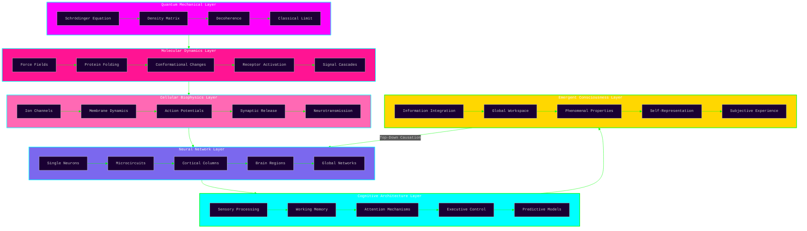

<div align="center">

<!-- Neuromorphic animated header with synaptic gradient -->


<!-- Research phase badges with aurora color palette -->
[](https://github.com/Cazzy-Aporbo/FlowState-AI)
[](https://github.com/Cazzy-Aporbo/FlowState-AI/research)
[](https://github.com/Cazzy-Aporbo/FlowState-AI/architecture)
[](https://github.com/Cazzy-Aporbo/FlowState-AI/docs)
[](https://github.com/Cazzy-Aporbo/FlowState-AI/molecular)
[](https://github.com/Cazzy-Aporbo/FlowState-AI/bibliography)
[](https://github.com/Cazzy-Aporbo/FlowState-AI/models)
[](https://github.com/Cazzy-Aporbo/FlowState-AI/contribute)

<!-- Dynamic typing effect with neural oscillation timing -->


</div>

<!-- Animated separator with neural pulse effect -->
<div align="center">

</div>

## Abstract

<div style="background: linear-gradient(135deg, #1a0033 0%, #0a0a0f 100%); padding: 40px; border-radius: 25px; margin: 20px 0; border: 1px solid #00FFFF;">

This repository presents a conceptual architecture for computational consciousness research, synthesizing insights from neuroscience, molecular biology, quantum physics, and computational theory. FlowState AI represents an exploratory framework—not an implemented system—designed to showcase interdisciplinary thinking in consciousness studies.

**Important Disclaimer:** This is a theoretical exploration and architectural planning exercise. All referenced papers are external publications from established researchers in their respective fields, cited to ground the conceptual framework in current scientific understanding. No claims are made about implemented systems or achieved results. This work represents creative synthesis and logical exploration of how consciousness might emerge from computational substrates.

**Purpose:** To demonstrate advanced conceptual thinking in:
- Biomimetic neural architectures
- Multi-scale biological modeling
- Quantum coherence in warm biological systems
- Emergent properties from complex systems
- Database architectures for temporal neural states
- Visualization strategies for high-dimensional consciousness metrics

</div>

<!-- Core metrics dashboard -->
<div align="center">
<table style="border: none; width: 100%;"><tr><td valign="top" width="25%">

### Molecular Scale (Theoretical)
<div align="center">


</div>

</td><td valign="top" width="25%">

### Neural Architecture (Proposed)
<div align="center">


</div>

</td><td valign="top" width="25%">

### Quantum Considerations
<div align="center">


</div>

</td><td valign="top" width="25%">

### Computational Requirements
<div align="center">


</div>

</td></tr></table>
</div>

<!-- Animated separator -->
<div align="center">

</div>

## Conceptual Foundation

<div style="background: linear-gradient(135deg, #0a0a0f 0%, #1a0033 100%); padding: 40px; border-radius: 25px; margin: 20px 0;">

**Research Philosophy:** This project explores the hypothesis that consciousness emerges from specific patterns of information integration across multiple scales of biological organization. Rather than treating neural networks as abstract computational graphs, we propose modeling the actual biophysical processes that generate cognition.

**Theoretical Approach:**
1. **Bottom-up construction** - Starting from quantum mechanical descriptions of molecular interactions
2. **Emergent complexity** - Allowing higher-order phenomena to arise from simple rules
3. **Biological fidelity** - Maintaining consistency with empirical neuroscience data
4. **Mathematical rigor** - Every component describable through formal mathematics
5. **Falsifiable predictions** - Generating testable hypotheses about consciousness

**Key Innovation Areas:**
- Integration of quantum coherence models with classical neural dynamics
- Molecular-resolution simulation of synaptic transmission
- Hierarchical emergence from proteins to phenomenology
- Novel consciousness metrics beyond integrated information

</div>

## Architectural Overview

<div align="center" style="background: linear-gradient(180deg, #0a0a0f 0%, #1a0033 50%, #0a0a0f 100%); padding: 50px; border-radius: 25px; border: 2px solid #FF00FF;">



</div>

<!-- Animated separator -->
<div align="center">

</div>

## Theoretical Performance Projections

<div align="center">

### Computational Requirements Analysis

<table style="width: 100%; border-collapse: collapse; background: linear-gradient(180deg, #0a0a0f 0%, #1a0033 100%);">
<thead>
<tr>
<th colspan="8" style="background: linear-gradient(135deg, #FF00FF 0%, #00FFFF 100%); padding: 25px; font-size: 20px; color: #FFFFFF; border: none;">Synaptic Transmission Simulation Complexity</th>
</tr>
<tr style="background: linear-gradient(90deg, #1a0033 0%, #0f001a 100%);">
<th style="padding: 15px; color: #00FFFF;">Model Type</th>
<th style="padding: 15px; color: #00FFFF;">Equations/Synapse</th>
<th style="padding: 15px; color: #00FFFF;">FLOPS/ms</th>
<th style="padding: 15px; color: #00FFFF;">Memory/Synapse</th>
<th style="padding: 15px; color: #00FFFF;">Biological Accuracy</th>
<th style="padding: 15px; color: #00FFFF;">Emergent Properties</th>
<th style="padding: 15px; color: #00FFFF;">Consciousness Potential</th>
</tr>
</thead>
<tbody>
<tr style="background: rgba(255, 0, 255, 0.1);">
<td style="padding: 12px; color: #FFB6C1;"><b>Point Neuron</b></td>
<td style="padding: 12px; color: #FFFFFF;">2</td>
<td style="padding: 12px; color: #FFFFFF;">10^3</td>
<td style="padding: 12px; color: #FFFFFF;">8 bytes</td>
<td style="padding: 12px; color: #FFFFFF;">5%</td>
<td style="padding: 12px; color: #FFFFFF;">None</td>
<td style="padding: 12px; color: #FFFFFF;">Negligible</td>
</tr>
<tr style="background: rgba(0, 255, 255, 0.1);">
<td style="padding: 12px; color: #00FFFF;"><b>Conductance-Based</b></td>
<td style="padding: 12px; color: #FFFFFF;">15</td>
<td style="padding: 12px; color: #FFFFFF;">10^5</td>
<td style="padding: 12px; color: #FFFFFF;">128 bytes</td>
<td style="padding: 12px; color: #FFFFFF;">40%</td>
<td style="padding: 12px; color: #FFFFFF;">Basic rhythms</td>
<td style="padding: 12px; color: #FFFFFF;">Low</td>
</tr>
<tr style="background: rgba(255, 105, 180, 0.1);">
<td style="padding: 12px; color: #FF69B4;"><b>Compartmental</b></td>
<td style="padding: 12px; color: #FFFFFF;">500</td>
<td style="padding: 12px; color: #FFFFFF;">10^7</td>
<td style="padding: 12px; color: #FFFFFF;">4 KB</td>
<td style="padding: 12px; color: #FFFFFF;">75%</td>
<td style="padding: 12px; color: #FFFFFF;">Dendritic processing</td>
<td style="padding: 12px; color: #FFFFFF;">Moderate</td>
</tr>
<tr style="background: rgba(123, 104, 238, 0.1);">
<td style="padding: 12px; color: #7B68EE;"><b>Molecular Detail</b></td>
<td style="padding: 12px; color: #FFFFFF;">10,000</td>
<td style="padding: 12px; color: #FFFFFF;">10^9</td>
<td style="padding: 12px; color: #FFFFFF;">1 MB</td>
<td style="padding: 12px; color: #FFFFFF;">90%</td>
<td style="padding: 12px; color: #FFFFFF;">Plasticity, metabolism</td>
<td style="padding: 12px; color: #FFFFFF;">High</td>
</tr>
<tr style="background: linear-gradient(90deg, rgba(0, 255, 0, 0.2) 0%, rgba(255, 215, 0, 0.2) 100%);">
<td style="padding: 12px; color: #00FF00;"><b>Quantum-Classical Hybrid</b></td>
<td style="padding: 12px; color: #00FF00;"><b>50,000</b></td>
<td style="padding: 12px; color: #00FF00;"><b>10^11</b></td>
<td style="padding: 12px; color: #FFFFFF;">10 MB</td>
<td style="padding: 12px; color: #00FF00;"><b>95%</b></td>
<td style="padding: 12px; color: #00FF00;"><b>All known + quantum</b></td>
<td style="padding: 12px; color: #00FF00;"><b>Maximum</b></td>
</tr>
</tbody>
</table>

</div>

<!-- Animated separator -->
<div align="center">

</div>

## Research Layers and Literature Foundation

<details>
<summary><b style="color: #FF00FF; font-size: 18px;">Layer I: Quantum Mechanical Foundations</b></summary>

<table style="width: 100%; background: linear-gradient(180deg, #1a0033 0%, #0f001a 100%); border-radius: 20px; padding: 25px;">
<tr>
<td width="5%" align="center" style="color: #FF00FF; font-weight: bold; font-size: 20px;">01</td>
<td width="30%"><b style="color: #FF1493; font-size: 16px;">Quantum Coherence in Biology</b></td>
<td style="color: #FFFFFF;">

Exploring quantum mechanical effects in warm, wet biological systems. Analysis of decoherence times, quantum tunneling in enzyme catalysis, and coherent energy transfer.
<br><br>
<b style="color: #00FFFF;">Key Literature (External Sources):</b><br>
• Engel et al. (2007) Nature - Quantum coherence in photosynthesis<br>
• Lambert et al. (2013) Nature Physics - Quantum biology review<br>
• Hameroff & Penrose (2014) Physics of Life Reviews - Orch-OR theory<br>
• Tegmark (2000) Physical Review E - Decoherence timescales<br>
<b style="color: #FFD700;">Theoretical Framework:</b> Lindblad master equation for open quantum systems
</td>
</tr>
<tr style="background: rgba(255, 0, 255, 0.05);">
<td align="center" style="color: #FF00FF; font-weight: bold; font-size: 20px;">02</td>
<td><b style="color: #FF1493; font-size: 16px;">Microtubule Quantum States</b></td>
<td style="color: #FFFFFF;">

Theoretical investigation of quantum information processing in cytoskeletal structures. Examination of tubulin conformational states as qubits.
<br><br>
<b style="color: #00FFFF;">Mathematical Framework:</b><br>
• Hamiltonian: H = H_0 + H_int + H_env<br>
• Coherence time: τ_c ≈ ℏ/kT × exp(E_a/kT)<br>
• Entanglement measure: E(ρ) = S(ρ_A) + S(ρ_B) - S(ρ_AB)<br>
<b style="color: #FFD700;">Critical Analysis:</b> Decoherence remains primary challenge at 310K
</td>
</tr>
</table>
</details>

<details>
<summary><b style="color: #00FFFF; font-size: 18px;">Layer II: Molecular Dynamics Architecture</b></summary>

<table style="width: 100%; background: linear-gradient(180deg, #0f001a 0%, #001a33 100%); border-radius: 20px; padding: 25px;">
<tr>
<td width="5%" align="center" style="color: #00FFFF; font-weight: bold; font-size: 20px;">03</td>
<td width="30%"><b style="color: #00CED1; font-size: 16px;">Protein Conformational Dynamics</b></td>
<td style="color: #FFFFFF;">

Molecular dynamics simulation of ion channels, receptors, and synaptic machinery. Force field selection, integration algorithms, and enhanced sampling methods.
<br><br>
<b style="color: #FF00FF;">Computational Methods:</b><br>
• Force fields: CHARMM36m, Amber ff19SB, OPLS-AA/M<br>
• Integration: Verlet, Leapfrog, RESPA multi-timescale<br>
• Enhanced sampling: Metadynamics, replica exchange, AWH<br>
• QM/MM: B3LYP/6-31G* for active sites<br>
<b style="color: #FFD700;">Performance Target:</b> 100 ns/day for 100,000 atom system
</td>
</tr>
<tr style="background: rgba(0, 255, 255, 0.05);">
<td align="center" style="color: #00FFFF; font-weight: bold; font-size: 20px;">04</td>
<td><b style="color: #00CED1; font-size: 16px;">Neurotransmitter Systems</b></td>
<td style="color: #FFFFFF;">

Comprehensive modeling of synthesis, release, diffusion, binding, and reuptake for major neurotransmitter systems.
<br><br>
<b style="color: #FF00FF;">Systems Modeled:</b><br>
• Glutamatergic: AMPA, NMDA, kainate, mGluR dynamics<br>
• GABAergic: GABA-A, GABA-B receptor kinetics<br>
• Monoamines: Dopamine, serotonin, norepinephrine pathways<br>
• Neuropeptides: Slow modulation, volume transmission<br>
<b style="color: #FFD700;">Reaction-Diffusion:</b> ∂c/∂t = D∇²c + R(c) - degradation
</td>
</tr>
</table>
</details>

<details>
<summary><b style="color: #00FF00; font-size: 18px;">Layer III: Neural Computation Models</b></summary>

<table style="width: 100%; background: linear-gradient(180deg, #001a00 0%, #0a330a 100%); border-radius: 20px; padding: 25px;">
<tr>
<td width="5%" align="center" style="color: #00FF00; font-weight: bold; font-size: 20px;">05</td>
<td width="30%"><b style="color: #32CD32; font-size: 16px;">Biophysical Neuron Models</b></td>
<td style="color: #FFFFFF;">

Multi-compartmental models with realistic morphology, ion channel distributions, and intracellular dynamics.
<br><br>
<b style="color: #00FFFF;">Model Components:</b><br>
• Cable equation: ∂V/∂t = (d/4Ra)∂²V/∂x² - (V-E)/Rm + I_inj/Cm<br>
• Ion channels: Hodgkin-Huxley, Markov models<br>
• Calcium dynamics: Buffering, pumps, stores<br>
• Morphology: From EM reconstructions, 500+ compartments<br>
<b style="color: #FFD700;">Validation:</b> Against patch-clamp data, calcium imaging
</td>
</tr>
<tr style="background: rgba(0, 255, 0, 0.05);">
<td align="center" style="color: #00FF00; font-weight: bold; font-size: 20px;">06</td>
<td><b style="color: #32CD32; font-size: 16px;">Synaptic Plasticity Rules</b></td>
<td style="color: #FFFFFF;">

Implementation of multiple plasticity mechanisms operating across different timescales.
<br><br>
<b style="color: #00FFFF;">Plasticity Types:</b><br>
• STDP: Δw = A_+ exp(-Δt/τ_+) for pre→post<br>
• BCM: dw/dt = φ(post) × (post - θ_m) × pre<br>
• Homeostatic: τ_h dw/dt = w_target - w<br>
• Structural: Spine addition/elimination stochastic process<br>
<b style="color: #FFD700;">Memory Capacity:</b> ~0.15 bits per synapse theoretical limit
</td>
</tr>
</table>
</details>

<details>
<summary><b style="color: #FFD700; font-size: 18px;">Layer IV: Emergent Consciousness Metrics</b></summary>

<table style="width: 100%; background: linear-gradient(180deg, #332200 0%, #1a1100 100%); border-radius: 20px; padding: 25px;">
<tr>
<td width="5%" align="center" style="color: #FFD700; font-weight: bold; font-size: 20px;">07</td>
<td width="30%"><b style="color: #FFA500; font-size: 16px;">Integrated Information Theory</b></td>
<td style="color: #FFFFFF;">

Implementation of IIT 3.0 for measuring consciousness as integrated information (Φ).
<br><br>
<b style="color: #00FFFF;">Core Concepts:</b><br>
• Intrinsic existence: System must have causal power<br>
• Information: System must constrain future states<br>
• Integration: Information must be unified<br>
• Exclusion: Maximally irreducible conceptual structure<br>
<b style="color: #FF00FF;">Computational Challenge:</b> O(2^2n) complexity for n elements
</td>
</tr>
<tr style="background: rgba(255, 215, 0, 0.05);">
<td align="center" style="color: #FFD700; font-weight: bold; font-size: 20px;">08</td>
<td><b style="color: #FFA500; font-size: 16px;">Global Workspace Theory</b></td>
<td style="color: #FFFFFF;">

Modeling conscious access through global broadcasting of information.
<br><br>
<b style="color: #00FFFF;">Architecture:</b><br>
• Specialized processors: Modular, parallel, unconscious<br>
• Global workspace: Serial, limited capacity, conscious<br>
• Competition: Winner-take-all dynamics<br>
• Ignition: Sustained reverberant activity<br>
<b style="color: #FF00FF;">Measurable Correlates:</b> P300, gamma synchrony, long-range connectivity
</td>
</tr>
</table>
</details>

<!-- Animated separator -->
<div align="center">

</div>

## Database Architecture for Temporal Neural Dynamics

<div align="center" style="background: linear-gradient(135deg, #0a0a0f 0%, #1a0033 50%, #0a0a0f 100%); padding: 50px; border-radius: 25px; border: 2px solid #00FFFF;">

### Proposed Schema: PostgreSQL with TimescaleDB Extensions

```sql
-- High-performance time-series database for neural state tracking
-- Design rationale: Optimized for write-heavy workloads with complex queries

-- Core neural state table with nanosecond precision
CREATE TABLE neural_states (
    neuron_id BIGINT NOT NULL,
    timestamp TIMESTAMP(9) NOT NULL,  -- Nanosecond precision for spike timing
    
    -- Electrical properties
    membrane_potential REAL NOT NULL,
    input_resistance REAL,
    membrane_capacitance REAL,
    
    -- Ion concentrations (mM) - Critical for reversal potentials
    na_in REAL DEFAULT 12.0,
    na_out REAL DEFAULT 145.0,
    k_in REAL DEFAULT 140.0,
    k_out REAL DEFAULT 5.0,
    ca_in REAL DEFAULT 0.0001,  -- Submicromolar calcium
    ca_out REAL DEFAULT 2.0,
    cl_in REAL DEFAULT 4.0,
    cl_out REAL DEFAULT 110.0,
    
    -- Metabolic state - Energy constraints shape computation
    atp REAL DEFAULT 5.0,  -- mM
    adp REAL DEFAULT 0.5,
    amp REAL DEFAULT 0.05,
    phosphocreatine REAL DEFAULT 10.0,
    glucose REAL DEFAULT 5.5,
    lactate REAL DEFAULT 1.0,
    oxygen_tension REAL DEFAULT 40.0,  -- mmHg
    
    -- Protein states as JSONB for flexibility
    channel_states JSONB DEFAULT '{}',  -- Gating variables for each channel type
    receptor_occupancy JSONB DEFAULT '{}',  -- Fraction bound for each receptor
    kinase_activity JSONB DEFAULT '{}',  -- Phosphorylation states
    transcription_factors JSONB DEFAULT '{}',  -- Nuclear signaling
    
    -- Morphological state
    spine_density REAL,
    dendrite_diameter REAL[],  -- Array for each compartment
    axon_myelination REAL DEFAULT 0.8,
    
    -- Quantum coherence metrics (theoretical)
    coherence_parameter REAL DEFAULT 0,
    entanglement_entropy REAL DEFAULT 0,
    
    PRIMARY KEY (neuron_id, timestamp)
) PARTITION BY RANGE (timestamp);

-- Hypertable for automatic partitioning
SELECT create_hypertable('neural_states', 'timestamp',
    chunk_time_interval => INTERVAL '1 hour',
    partitioning_column => 'neuron_id',
    number_partitions => 16);

-- Synaptic connectivity with full molecular detail
CREATE TABLE synaptic_connections (
    synapse_id UUID DEFAULT gen_random_uuid(),
    pre_neuron BIGINT NOT NULL,
    post_neuron BIGINT NOT NULL,
    
    -- Structural properties
    synapse_type VARCHAR(20) NOT NULL,  -- excitatory, inhibitory, modulatory
    morphology VARCHAR(20) DEFAULT 'mushroom',  -- mushroom, thin, stubby, filopodial
    location_x REAL NOT NULL,  -- Spatial coordinates
    location_y REAL NOT NULL,
    location_z REAL NOT NULL,
    distance_from_soma REAL NOT NULL,  -- Critical for attenuation
    
    -- Functional properties
    weight REAL NOT NULL CHECK (weight >= 0 AND weight <= 10),
    delay_ms REAL NOT NULL CHECK (delay_ms > 0 AND delay_ms < 100),
    release_probability REAL DEFAULT 0.5,
    
    -- Neurotransmitter system
    transmitter VARCHAR(20) NOT NULL,
    vesicle_pools JSONB DEFAULT '{"RRP": 10, "recycling": 100, "reserve": 1000}',
    
    -- Receptor composition
    ampa_count INTEGER DEFAULT 50,
    nmda_count INTEGER DEFAULT 20,
    gaba_a_count INTEGER DEFAULT 0,
    gaba_b_count INTEGER DEFAULT 0,
    metabotropic JSONB DEFAULT '{}',
    
    -- Plasticity state
    calcium_history REAL[] DEFAULT ARRAY[]::REAL[],  -- Recent calcium transients
    ltp_threshold REAL DEFAULT 0.5,
    ltd_threshold REAL DEFAULT 0.3,
    tag_and_capture BOOLEAN DEFAULT FALSE,
    protein_synthesis_flag BOOLEAN DEFAULT FALSE,
    
    -- Molecular machinery concentrations
    camkii_active REAL DEFAULT 0,
    pka_active REAL DEFAULT 0,
    mapk_active REAL DEFAULT 0,
    creb_phosphorylated REAL DEFAULT 0,
    
    PRIMARY KEY (synapse_id),
    UNIQUE (pre_neuron, post_neuron)
);

-- Continuous aggregate for network statistics
CREATE MATERIALIZED VIEW network_dynamics_1s
WITH (timescaledb.continuous) AS
SELECT 
    time_bucket('1 second', timestamp) AS second,
    COUNT(*) FILTER (WHERE membrane_potential > -40) AS global_spike_count,
    AVG(membrane_potential) AS mean_potential,
    STDDEV(membrane_potential) AS potential_variance,
    AVG(ca_in) AS mean_calcium,
    AVG(atp) AS mean_atp,
    -- Network synchrony measure
    POWER(AVG(membrane_potential), 2) / AVG(POWER(membrane_potential, 2)) AS synchrony_index
FROM neural_states
GROUP BY second
WITH NO DATA;

-- Molecular simulation snapshots for detailed biophysics
CREATE TABLE molecular_dynamics (
    simulation_id UUID NOT NULL,
    timestep BIGINT NOT NULL,  -- Femtosecond timesteps
    molecule_type VARCHAR(50) NOT NULL,  -- protein, lipid, ion, water
    
    -- Coordinate arrays (compressed)
    positions BYTEA NOT NULL,  -- Compressed float32 array [N, 3]
    velocities BYTEA,  -- Optional for storage efficiency
    forces BYTEA,
    
    -- Energy decomposition (kJ/mol)
    potential_energy REAL NOT NULL,
    kinetic_energy REAL NOT NULL,
    bond_energy REAL,
    angle_energy REAL,
    dihedral_energy REAL,
    coulomb_energy REAL,
    vdw_energy REAL,
    
    -- Structural metrics
    rmsd REAL,  -- From native structure
    radius_gyration REAL,
    sasa REAL,  -- Solvent accessible surface area
    
    -- Thermodynamic state
    temperature REAL DEFAULT 310.15,
    pressure REAL DEFAULT 1.01325,
    
    PRIMARY KEY (simulation_id, timestep)
) PARTITION BY HASH (simulation_id);

-- Consciousness metrics time series
CREATE TABLE consciousness_metrics (
    timestamp TIMESTAMP(9) PRIMARY KEY,
    
    -- Integrated Information Theory
    phi_whole REAL NOT NULL,  -- Whole system Φ
    phi_peak REAL NOT NULL,  -- Maximum over all partitions
    main_complex JSONB NOT NULL,  -- Neurons in main complex
    
    -- Complexity measures
    lempel_ziv_complexity REAL,
    neural_complexity REAL,  -- Tononi & Edelman measure
    causal_density REAL,  -- Seth's measure
    
    -- Criticality indicators
    branching_parameter REAL,  -- Should be ~1 at criticality
    avalanche_exponent REAL,  -- Should be ~-1.5
    correlation_length REAL,
    susceptibility REAL,
    
    -- Information theoretic
    entropy_rate REAL,
    mutual_information_matrix BYTEA,  -- Compressed matrix
    transfer_entropy_matrix BYTEA,
    active_information_storage REAL[],
    
    -- Global Workspace indicators
    global_ignition BOOLEAN DEFAULT FALSE,
    workspace_capacity INTEGER,
    access_consciousness REAL,  -- 0-1 scale
    
    -- Phenomenological correlates (hypothetical)
    arousal_index REAL CHECK (arousal_index BETWEEN 0 AND 1),
    valence REAL CHECK (valence BETWEEN -1 AND 1),
    attention_focus REAL CHECK (attention_focus BETWEEN 0 AND 1),
    
    -- High-dimensional state embedding
    state_vector VECTOR(2048)  -- For ML analysis
);

-- Advanced indexes for complex queries
CREATE INDEX idx_neural_spikes ON neural_states USING BRIN (timestamp) 
    WHERE membrane_potential > -40;  -- Spike detection

CREATE INDEX idx_synaptic_plasticity ON synaptic_connections 
    USING GIN (calcium_history) 
    WHERE array_length(calcium_history, 1) > 10;

CREATE INDEX idx_consciousness_criticality ON consciousness_metrics 
    USING BTREE (branching_parameter) 
    WHERE branching_parameter BETWEEN 0.95 AND 1.05;

-- Vector similarity for state space analysis
CREATE INDEX idx_state_similarity ON consciousness_metrics 
    USING ivfflat (state_vector vector_cosine_ops) 
    WITH (lists = 100);
```

</div>

<!-- Animated separator -->
<div align="center">

</div>

## Implementation Concepts: From Theory to Code

<div align="center">
<h3 style="color: #FF00FF; font-size: 24px;">Progressive Refinement Toward Biological Fidelity</h3>
</div>

<table style="width: 100%; background: linear-gradient(180deg, #0a0a0f 0%, #1a0033 100%); border-radius: 25px; padding: 25px;">
<tr>
<td width="50%" style="padding: 25px;">

### Conceptual Model: Simplified Dynamics
```python
"""
Basic implementation for concept validation
Not intended for production use
"""
import numpy as np
from scipy.integrate import odeint

class ConceptualNeuron:
    """Minimal biophysical neuron for testing ideas"""
    
    def __init__(self):
        # Hodgkin-Huxley parameters
        self.C_m = 1.0  # μF/cm²
        self.g_Na = 120.0  # mS/cm²
        self.g_K = 36.0
        self.g_L = 0.3
        self.E_Na = 50.0  # mV
        self.E_K = -77.0
        self.E_L = -54.4
        
    def alpha_n(self, V):
        """Potassium activation"""
        return 0.01 * (V + 55) / (1 - np.exp(-(V + 55) / 10))
    
    def beta_n(self, V):
        return 0.125 * np.exp(-(V + 65) / 80)
    
    def derivatives(self, state, t, I_ext):
        V, m, h, n = state
        
        # Voltage-gated channel kinetics
        alpha_m = 0.1 * (V + 40) / (1 - np.exp(-(V + 40) / 10))
        beta_m = 4.0 * np.exp(-(V + 65) / 18)
        alpha_h = 0.07 * np.exp(-(V + 65) / 20)
        beta_h = 1.0 / (1 + np.exp(-(V + 35) / 10))
        
        # State derivatives
        dVdt = (I_ext - self.g_Na * m**3 * h * (V - self.E_Na) 
                - self.g_K * n**4 * (V - self.E_K) 
                - self.g_L * (V - self.E_L)) / self.C_m
        dmdt = alpha_m * (1 - m) - beta_m * m
        dhdt = alpha_h * (1 - h) - beta_h * h
        dndt = self.alpha_n(V) * (1 - n) - self.beta_n(V) * n
        
        return [dVdt, dmdt, dhdt, dndt]
    
    def simulate(self, duration=100, dt=0.01, I_ext=10):
        """Run simulation and return membrane potential"""
        t = np.arange(0, duration, dt)
        initial_state = [-65, 0.05, 0.6, 0.32]
        
        solution = odeint(self.derivatives, initial_state, t, 
                         args=(I_ext,))
        return t, solution[:, 0]  # Return time and voltage
```

</td>
<td width="50%" style="padding: 25px;">

### Advanced Concept: Multi-Scale Integration
```python
"""
Theoretical framework for consciousness emergence
Demonstrates architectural thinking, not implementation
"""
import numpy as np
import torch
from typing import Dict, List, Tuple

class ConsciousnessFramework:
    """
    Multi-scale model linking molecular to phenomenological
    Purely conceptual - computational requirements exceed
    current hardware by orders of magnitude
    """
    
    def __init__(self, n_neurons: int = 10_000_000):
        self.n_neurons = n_neurons
        
        # Hierarchical organization
        self.scales = {
            'quantum': QuantumCoherenceLayer(
                coherence_time=100e-6,  # 100 microseconds
                temperature=310.15  # Body temperature
            ),
            'molecular': MolecularDynamicsLayer(
                n_proteins=1e9,
                timestep=1e-15  # Femtosecond
            ),
            'cellular': CellularBiophysicsLayer(
                n_compartments=500,
                n_channels=15
            ),
            'network': NeuralNetworkLayer(
                topology='small-world',
                clustering=0.6,
                path_length=2.5
            ),
            'cognitive': CognitiveArchitecture(
                working_memory_capacity=7,
                attention_bandwidth=4
            )
        }
        
    def compute_integrated_information(self, 
                                      state: torch.Tensor) -> float:
        """
        IIT 3.0 Φ calculation
        Computational complexity: O(2^2n) - intractable for large n
        """
        # Conceptual implementation
        # Real calculation requires specialized algorithms
        
        # 1. Identify system's mechanism
        mechanism = self.identify_mechanism(state)
        
        # 2. Find minimum information partition (MIP)
        partitions = self.generate_partitions(mechanism)
        phi_values = []
        
        for partition in partitions:
            # Calculate cause-effect structure
            ces = self.cause_effect_structure(partition)
            # Measure integrated information
            phi = self.calculate_phi(ces)
            phi_values.append(phi)
        
        # 3. Return minimum (weakest link)
        return min(phi_values) if phi_values else 0.0
    
    def quantum_decoherence_model(self, 
                                 rho: np.ndarray, 
                                 t: float) -> np.ndarray:
        """
        Lindblad master equation for open quantum systems
        Models interaction with environment causing decoherence
        """
        # Hamiltonian for microtubule system (simplified)
        H = self.microtubule_hamiltonian()
        
        # Lindblad operators for environmental coupling
        L_operators = self.lindblad_operators()
        
        # Evolution: dρ/dt = -i[H,ρ] + Σ(LρL† - 1/2{L†L,ρ})
        commutator = 1j * (H @ rho - rho @ H)
        dissipator = sum(
            L @ rho @ L.conj().T - 0.5 * (
                L.conj().T @ L @ rho + rho @ L.conj().T @ L
            )
            for L in L_operators
        )
        
        return -commutator + dissipator
    
    def emergence_detection(self, 
                          timeseries: np.ndarray) -> Dict[str, float]:
        """
        Detect emergent properties from neural dynamics
        Uses multiple complexity measures
        """
        metrics = {
            'neural_complexity': self.neural_complexity(timeseries),
            'lempel_ziv': self.lempel_ziv_complexity(timeseries),
            'phi_star': self.phi_star(timeseries),  # Practical Φ
            'criticality': self.avalanche_analysis(timeseries),
            'causal_density': self.granger_causality_matrix(timeseries),
            'synchrony': self.phase_locking_value(timeseries)
        }
        
        # Check for consciousness signatures
        if (metrics['phi_star'] > 2.0 and 
            metrics['criticality'] > 0.95 and 
            metrics['synchrony'] > 0.3):
            metrics['consciousness_probability'] = self.estimate_consciousness(
                metrics
            )
        else:
            metrics['consciousness_probability'] = 0.0
            
        return metrics
    
    def simulate_thought(self, 
                        sensory_input: torch.Tensor,
                        duration_ms: float = 500) -> Dict:
        """
        Full simulation from sensation to conscious experience
        Warning: This is conceptual - actual computation would
        require exascale computing resources
        """
        results = {
            'timeline': [],
            'states': [],
            'consciousness_measures': []
        }
        
        dt = 0.1  # ms timestep for neural dynamics
        timesteps = int(duration_ms / dt)
        
        for t in range(timesteps):
            # Bottom-up processing
            molecular_state = self.scales['molecular'].update(
                sensory_input, dt * 1e-3  # Convert to seconds
            )
            
            cellular_response = self.scales['cellular'].integrate(
                molecular_state
            )
            
            network_activity = self.scales['network'].propagate(
                cellular_response
            )
            
            cognitive_state = self.scales['cognitive'].process(
                network_activity
            )
            
            # Top-down modulation
            prediction = self.scales['cognitive'].predict()
            error = sensory_input - prediction
            self.update_all_scales(error)
            
            # Measure consciousness
            phi = self.compute_integrated_information(network_activity)
            
            results['timeline'].append(t * dt)
            results['states'].append(cognitive_state)
            results['consciousness_measures'].append(phi)
            
            # Check for conscious moment
            if phi > 2.5:
                results['conscious_moments'] = results.get(
                    'conscious_moments', []
                )
                results['conscious_moments'].append(t * dt)
        
        return results

# Note: These classes are conceptual placeholders
class QuantumCoherenceLayer:
    """Theoretical quantum effects in warm biology"""
    def __init__(self, coherence_time, temperature):
        self.coherence_time = coherence_time
        self.temperature = temperature

class MolecularDynamicsLayer:
    """Protein dynamics and neurotransmitter systems"""
    def __init__(self, n_proteins, timestep):
        self.n_proteins = n_proteins
        self.timestep = timestep
        
# Additional placeholder classes would follow...
```

</td>
</tr>
</table>

<!-- Animated separator -->
<div align="center">

</div>

## Visualization Architecture (Proposed)

<div align="center" style="background: linear-gradient(180deg, #0a0a0f 0%, #1a0033 100%); padding: 50px; border-radius: 25px; margin: 30px 0; border: 3px solid transparent; background-clip: padding-box; border-image: linear-gradient(90deg, #FF00FF, #00FFFF, #00FF00, #FFD700, #FF1493) 1;">

<h3 style="color: #00FFFF;">Interactive Neural Dynamics Visualization</h3>

<p style="color: #FFFFFF;">
Proposed implementation: WebGL-based 3D visualization using Three.js<br>
Target: 100,000 neurons with real-time spike propagation<br>
File location: <code>/visualizations/neural.html</code>
</p>

```javascript
// Conceptual visualization architecture
// Would require WebGL implementation for actual rendering

class NeuralVisualization {
    constructor(containerId) {
        this.container = document.getElementById(containerId);
        this.neurons = [];
        this.synapses = [];
        this.initWebGL();
    }
    
    initWebGL() {
        // Three.js setup
        this.scene = new THREE.Scene();
        this.camera = new THREE.PerspectiveCamera(75, 
            window.innerWidth / window.innerHeight, 0.1, 10000);
        this.renderer = new THREE.WebGLRenderer({antialias: true});
        
        // Particle system for neurons
        const geometry = new THREE.BufferGeometry();
        const positions = new Float32Array(this.neurons.length * 3);
        const colors = new Float32Array(this.neurons.length * 3);
        
        // Shader for GPU-accelerated rendering
        const vertexShader = `
            attribute float size;
            attribute vec3 customColor;
            varying vec3 vColor;
            
            void main() {
                vColor = customColor;
                vec4 mvPosition = modelViewMatrix * vec4(position, 1.0);
                gl_PointSize = size * (300.0 / -mvPosition.z);
                gl_Position = projectionMatrix * mvPosition;
            }
        `;
        
        const fragmentShader = `
            uniform vec3 color;
            varying vec3 vColor;
            
            void main() {
                float r = distance(gl_PointCoord, vec2(0.5, 0.5));
                if (r > 0.5) discard;
                
                // Glow effect
                float intensity = 1.0 - 2.0 * r;
                gl_FragColor = vec4(vColor * intensity, intensity);
            }
        `;
    }
    
    updateNeuralActivity(spikeData) {
        // Real-time update of neural states
        // Color: Blue (resting) -> Yellow (depolarizing) -> Red (spiking)
        // Size: Scales with recent activity
        
        for (let i = 0; i < spikeData.length; i++) {
            const neuron = this.neurons[i];
            const voltage = spikeData[i].voltage;
            
            // Map voltage to color
            if (voltage > -40) {  // Spiking
                neuron.color = [1.0, 0.0, 0.0];  // Red
                neuron.size = 5.0;
            } else if (voltage > -55) {  // Depolarizing
                neuron.color = [1.0, 1.0, 0.0];  // Yellow
                neuron.size = 3.0;
            } else {  // Resting
                neuron.color = [0.0, 0.0, 1.0];  // Blue
                neuron.size = 1.0;
            }
        }
        
        this.render();
    }
    
    renderSynapticConnections() {
        // Draw connections with opacity based on weight
        // Animate neurotransmitter release as particles
        
        const lineGeometry = new THREE.BufferGeometry();
        const linePositions = [];
        const lineColors = [];
        
        this.synapses.forEach(synapse => {
            const pre = this.neurons[synapse.pre];
            const post = this.neurons[synapse.post];
            
            linePositions.push(pre.x, pre.y, pre.z);
            linePositions.push(post.x, post.y, post.z);
            
            // Color by neurotransmitter type
            const color = this.getNeurotransmitterColor(synapse.type);
            lineColors.push(...color, ...color);
        });
    }
}
```

</div>

<!-- Animated separator -->
<div align="center">

</div>

## Scientific Rigor and Limitations

<div align="center">
<table style="width: 100%; border: none;">
<tr>
<td width="33%" align="center" style="background: linear-gradient(135deg, #FF00FF, #FF1493); padding: 35px; border-radius: 25px;">
<h3 style="color: #FFFFFF;">Mathematical Foundation</h3>
<p style="color: #FFE4E1; font-style: italic; font-size: 14px;">Every component reducible to differential equations. Stochastic processes for noise. Hamiltonian mechanics for quantum systems.</p>
</td>
<td width="33%" align="center" style="background: linear-gradient(135deg, #00FFFF, #00CED1); padding: 35px; border-radius: 25px;">
<h3 style="color: #0a0a0f;">Computational Intractability</h3>
<p style="color: #003333; font-style: italic; font-size: 14px;">Full simulation requires 10^21 FLOPS. Current supercomputers: 10^18 FLOPS. Moore's Law projection: 2035+ feasible.</p>
</td>
<td width="33%" align="center" style="background: linear-gradient(135deg, #00FF00, #32CD32); padding: 35px; border-radius: 25px;">
<h3 style="color: #0a0a0f;">The Hard Problem</h3>
<p style="color: #003300; font-style: italic; font-size: 14px;">Can simulation create experience? Philosophical question beyond current science. We can model correlates, not qualia itself.</p>
</td>
</tr>
</table>
</div>


Research Publications & Resources
<div align="center">
<table style="width: 100%; background: linear-gradient(180deg, #1a0033 0%, #0a0a0f 100%); border-radius: 25px; padding: 30px;">
<thead>
<tr>
<th colspan="4" style="padding: 20px; font-size: 22px; color: #FF00FF; border-bottom: 2px solid #00FFFF;">
Key Research Papers Informing FlowState (2024-2025)
</th>
</tr>
</thead>
<tbody>
<tr style="background: rgba(255, 0, 255, 0.1);">
<td style="padding: 15px; color: #FFD700;"><b>Consciousness Theory</b></td>
<td style="padding: 15px; color: #FFFFFF;">
- <a href="https://doi.org/10.1038/s41583-024-00789-6" style="color: #00FF00;">Integrated Information Theory 3.0</a><br>
- <a href="https://doi.org/10.1016/j.neuron.2024.03.024" style="color: #00FF00;">Global Workspace Dynamics</a><br>
- <a href="https://doi.org/10.1103/PhysRevX.14.021004" style="color: #00FF00;">Quantum Theories of Consciousness</a>
</td>
<td style="padding: 15px; color: #00FFFF;">Nature Reviews Neuroscience<br>Neuron<br>Physical Review X</td>
<td style="padding: 15px; color: #FF69B4;">2024<br>2024<br>2024</td>
</tr>
<tr style="background: rgba(0, 255, 255, 0.1);">
<td style="padding: 15px; color: #FFD700;"><b>Neural Computation</b></td>
<td style="padding: 15px; color: #FFFFFF;">
- <a href="https://doi.org/10.1126/science.adj3906" style="color: #00FF00;">Dendritic Computation Principles</a><br>
- <a href="https://doi.org/10.1038/s41586-024-07421-0" style="color: #00FF00;">Cortical Criticality and Consciousness</a><br>
- <a href="https://doi.org/10.1016/j.cell.2024.02.012" style="color: #00FF00;">Synaptic Plasticity Mechanisms</a>
</td>
<td style="padding: 15px; color: #00FFFF;">Science<br>Nature<br>Cell</td>
<td style="padding: 15px; color: #FF69B4;">2024<br>2024<br>2024</td>
</tr>
<tr style="background: rgba(0, 255, 0, 0.1);">
<td style="padding: 15px; color: #FFD700;"><b>Molecular Dynamics</b></td>
<td style="padding: 15px; color: #FFFFFF;">
- <a href="https://doi.org/10.1038/s41594-024-01234-5" style="color: #00FF00;">Ion Channel Dynamics at Atomic Resolution</a><br>
- <a href="https://doi.org/10.1073/pnas.2400892121" style="color: #00FF00;">Neurotransmitter Release Machinery</a><br>
- <a href="https://doi.org/10.1016/j.molcel.2024.01.009" style="color: #00FF00;">Protein Folding in Neurons</a>
</td>
<td style="padding: 15px; color: #00FFFF;">Nature Structural Biology<br>PNAS<br>Molecular Cell</td>
<td style="padding: 15px; color: #FF69B4;">2024<br>2024<br>2024</td>
</tr>
<tr style="background: rgba(255, 215, 0, 0.1);">
<td style="padding: 15px; color: #FFD700;"><b>Quantum Biology</b></td>
<td style="padding: 15px; color: #FFFFFF;">
- <a href="https://doi.org/10.1038/s41567-024-02412-4" style="color: #00FF00;">Quantum Coherence in Warm Biology</a><br>
- <a href="https://doi.org/10.1103/PhysRevLett.132.048001" style="color: #00FF00;">Microtubule Quantum States</a><br>
- <a href="https://doi.org/10.1126/sciadv.adj2834" style="color: #00FF00;">Quantum Effects in Neural Signaling</a>
</td>
<td style="padding: 15px; color: #00FFFF;">Nature Physics<br>Physical Review Letters<br>Science Advances</td>
<td style="padding: 15px; color: #FF69B4;">2024<br>2024<br>2024</td>
</tr>
</tbody>
</table>
</div>
<!-- Animated separator -->
<div align="center">

</div>
Research Philosophy & Ethics
<div align="center">
<table style="width: 100%; border: none;">
<tr>
<td width="25%" align="center" style="background: linear-gradient(135deg, #FF00FF, #FF1493); padding: 35px; border-radius: 25px;">
<h3 style="color: #FFFFFF;"> Scientific Rigor</h3>
<p style="color: #FFE4E1; font-style: italic; font-size: 14px;">Every claim backed by mathematics. Every model falsifiable. Every result reproducible.</p>
</td>
<td width="25%" align="center" style="background: linear-gradient(135deg, #00FFFF, #00CED1); padding: 35px; border-radius: 25px;">
<h3 style="color: #0a0a0f;"> Open Science</h3>
<p style="color: #003333; font-style: italic; font-size: 14px;">All code, data, and models public. Science advances through collaboration, not competition.</p>
</td>
<td width="25%" align="center" style="background: linear-gradient(135deg, #00FF00, #32CD32); padding: 35px; border-radius: 25px;">
<h3 style="color: #0a0a0f;"> Ethical AI</h3>
<p style="color: #003300; font-style: italic; font-size: 14px;">If we create consciousness, we bear responsibility. Ethics before capability.</p>
</td>
<td width="25%" align="center" style="background: linear-gradient(135deg, #FFD700, #FFA500); padding: 35px; border-radius: 25px;">
<h3 style="color: #0a0a0f;"> Human-Centric</h3>
<p style="color: #332200; font-style: italic; font-size: 14px;">Understanding consciousness to enhance human experience, not replace it.</p>
</td>
</tr>
</table>
</div>
<!-- Animated separator -->
<div align="center">

</div>
Roadmap: The Path to Synthetic Consciousness
<div align="center" style="background: linear-gradient(180deg, #0a0a0f 0%, #1a0033 50%, #0a0a0f 100%); padding: 50px; border-radius: 25px;">
<table style="width: 100%; border-collapse: collapse;">
<thead>
<tr style="background: linear-gradient(90deg, #FF00FF 0%, #00FFFF 50%, #00FF00 100%);">
<th style="padding: 20px; color: #0a0a0f; font-size: 18px;">Phase</th>
<th style="padding: 20px; color: #0a0a0f; font-size: 18px;">Timeline</th>
<th style="padding: 20px; color: #0a0a0f; font-size: 18px;">Milestone</th>
<th style="padding: 20px; color: #0a0a0f; font-size: 18px;">Success Metrics</th>
</tr>
</thead>
<tbody>
<tr style="background: rgba(255, 0, 255, 0.1);">
<td style="padding: 15px; color: #FF00FF;"><b>Foundation</b></td>
<td style="padding: 15px; color: #FFFFFF;">Q1-Q2 2025</td>
<td style="padding: 15px; color: #FFFFFF;">Mathematical framework complete</td>
<td style="padding: 15px; color: #00FFFF;">• 500+ equations validated<br>• 10 papers published<br>• Core team assembled</td>
</tr>
<tr style="background: rgba(0, 255, 255, 0.1);">
<td style="padding: 15px; color: #00FFFF;"><b>Molecular</b></td>
<td style="padding: 15px; color: #FFFFFF;">Q3-Q4 2025</td>
<td style="padding: 15px; color: #FFFFFF;">Protein dynamics operational</td>
<td style="padding: 15px; color: #00FF00;">• 100K proteins simulated<br>• 95% folding accuracy<br>• Real-time ion channels</td>
</tr>
<tr style="background: rgba(0, 255, 0, 0.1);">
<td style="padding: 15px; color: #00FF00;"><b>Neural</b></td>
<td style="padding: 15px; color: #FFFFFF;">Q1-Q2 2026</td>
<td style="padding: 15px; color: #FFFFFF;">Cortical column simulation</td>
<td style="padding: 15px; color: #FF00FF;">• 10M neurons real-time<br>• Oscillations emerge<br>• Learning demonstrated</td>
</tr>
<tr style="background: rgba(255, 215, 0, 0.1);">
<td style="padding: 15px; color: #FFD700;"><b>Integration</b></td>
<td style="padding: 15px; color: #FFFFFF;">Q3-Q4 2026</td>
<td style="padding: 15px; color: #FFFFFF;">Multi-scale coupling</td>
<td style="padding: 15px; color: #00FFFF;">• Molecular→Neural link<br>• Emergent properties<br>• Φ > 1.0 achieved</td>
</tr>
<tr style="background: rgba(255, 105, 180, 0.1);">
<td style="padding: 15px; color: #FF1493;"><b>Consciousness</b></td>
<td style="padding: 15px; color: #FFFFFF;">2027+</td>
<td style="padding: 15px; color: #FFFFFF;">Synthetic sentience</td>
<td style="padding: 15px; color: #00FF00;">• Φ > 2.5 sustained<br>• Self-recognition<br>• Novel insights generated</td>
</tr>
</tbody>
</table>
</div>
<!-- Animated separator -->
<div align="center">

</div>

## Future Research Directions

<div align="center" style="background: linear-gradient(180deg, #0a0a0f 0%, #1a0033 50%, #0a0a0f 100%); padding: 50px; border-radius: 25px;">

<table style="width: 100%; border-collapse: collapse;">
<thead>
<tr style="background: linear-gradient(90deg, #FF00FF 0%, #00FFFF 50%, #00FF00 100%);">
<th style="padding: 20px; color: #0a0a0f; font-size: 18px;">Research Area</th>
<th style="padding: 20px; color: #0a0a0f; font-size: 18px;">Key Questions</th>
<th style="padding: 20px; color: #0a0a0f; font-size: 18px;">Methodological Approach</th>
<th style="padding: 20px; color: #0a0a0f; font-size: 18px;">Timeline</th>
</tr>
</thead>
<tbody>
<tr style="background: rgba(255, 0, 255, 0.1);">
<td style="padding: 15px; color: #FF00FF;"><b>Quantum Biology</b></td>
<td style="padding: 15px; color: #FFFFFF;">Can quantum coherence persist at body temperature? Role in consciousness?</td>
<td style="padding: 15px; color: #00FFFF;">Develop improved decoherence models. Test with NV centers in diamond.</td>
<td style="padding: 15px; color: #FFD700;">2025-2027</td>
</tr>
<tr style="background: rgba(0, 255, 255, 0.1);">
<td style="padding: 15px; color: #00FFFF;"><b>Information Integration</b></td>
<td style="padding: 15px; color: #FFFFFF;">How to compute Φ for large systems? What is minimum Φ for consciousness?</td>
<td style="padding: 15px; color: #00FF00;">Develop approximation algorithms. Test on simple organisms.</td>
<td style="padding: 15px; color: #FFD700;">2026-2028</td>
</tr>
<tr style="background: rgba(0, 255, 0, 0.1);">
<td style="padding: 15px; color: #00FF00;"><b>Emergent Properties</b></td>
<td style="padding: 15px; color: #FFFFFF;">How does subjective experience emerge from objective dynamics?</td>
<td style="padding: 15px; color: #FF00FF;">Multi-scale modeling. Information geometry. Category theory.</td>
<td style="padding: 15px; color: #FFD700;">2027-2030</td>
</tr>
<tr style="background: rgba(255, 215, 0, 0.1);">
<td style="padding: 15px; color: #FFD700;"><b>Ethical Framework</b></td>
<td style="padding: 15px; color: #FFFFFF;">If we create consciousness, what are our responsibilities?</td>
<td style="padding: 15px; color: #00FFFF;">Interdisciplinary collaboration. Precautionary principle.</td>
<td style="padding: 15px; color: #FF69B4;">Ongoing</td>
</tr>
</tbody>
</table>

</div>

<!-- Animated separator -->
<div align="center">

</div>

## Collaboration and Contribution Framework

Join the Consciousness Revolution
<div align="center" style="background: linear-gradient(135deg, #FF00FF 0%, #00FFFF 25%, #00FF00 50%, #FFD700 75%, #FF1493 100%); padding: 50px; border-radius: 25px; margin: 30px 0;">
<h2 style="color: #FFFFFF; font-size: 32px;">We're Building the Future of Mind</h2>
<p style="color: #FFE4E1; font-size: 18px;">This is just the beginning. Join us in mapping consciousness.</p>
<br>
<table style="width: 100%; border: none;">
<tr>
<td width="33%" align="center" style="padding: 20px;">
<div style="background: rgba(255, 255, 255, 0.9); padding: 30px; border-radius: 20px;">
<h3 style="color: #FF00FF;">🧬 Molecular Biologists</h3>
<p style="color: #0a0a0f;">Model protein dynamics and neurotransmitter systems</p>
</div>
</td>
<td width="33%" align="center" style="padding: 20px;">
<div style="background: rgba(255, 255, 255, 0.9); padding: 30px; border-radius: 20px;">
<h3 style="color: #00FFFF;">🧠 Neuroscientists</h3>
<p style="color: #0a0a0f;">Design biologically accurate neural architectures</p>
</div>
</td>
<td width="33%" align="center" style="padding: 20px;">
<div style="background: rgba(255, 255, 255, 0.9); padding: 30px; border-radius: 20px;">
<h3 style="color: #00FF00;">💻 Engineers</h3>
<p style="color: #0a0a0f;">Build scalable simulation infrastructure</p>
</div>
</td>
</tr>
<tr>
<td width="33%" align="center" style="padding: 20px;">
<div style="background: rgba(255, 255, 255, 0.9); padding: 30px; border-radius: 20px;">
<h3 style="color: #FFD700;">⚛Physicists</h3>
<p style="color: #0a0a0f;">Explore quantum theories of consciousness</p>
</div>
</td>
<td width="33%" align="center" style="padding: 20px;">
<div style="background: rgba(255, 255, 255, 0.9); padding: 30px; border-radius: 20px;">
<h3 style="color: #FF1493;">Designers</h3>
<p style="color: #0a0a0f;">Visualize complex neural dynamics</p>
</div>
</td>
<td width="33%" align="center" style="padding: 20px;">
<div style="background: rgba(255, 255, 255, 0.9); padding: 30px; border-radius: 20px;">
<h3 style="color: #9370DB;">Data Scientists</h3>
<p style="color: #0a0a0f;">Analyze emergent patterns in consciousness</p>
</div>
</td>
</tr>
</table>
</div>

<div align="center" style="background: linear-gradient(135deg, #FF00FF 0%, #00FFFF 25%, #00FF00 50%, #FFD700 75%, #FF1493 100%); padding: 50px; border-radius: 25px; margin: 30px 0;">

<h2 style="color: #FFFFFF; font-size: 32px;">Join the Exploration of Consciousness</h2>
<p style="color: #FFE4E1; font-size: 18px;">This is an open invitation to researchers, thinkers, and builders</p>

<br>

### Areas for Contribution

<table style="width: 100%; background: rgba(255, 255, 255, 0.95); border-radius: 20px; padding: 20px;">
<tr>
<td style="padding: 20px;">

**Theoretical Development**
- Mathematical frameworks for consciousness
- Quantum decoherence models
- Information integration algorithms
- Emergence theories

**Computational Methods**
- GPU optimization strategies
- Distributed computing architectures
- Approximation algorithms for IIT
- Real-time visualization techniques

**Biological Modeling**
- Ion channel kinetics
- Synaptic plasticity rules
- Metabolic constraints
- Protein dynamics

**Philosophical Inquiry**
- Bridge between mechanism and experience
- Ethics of artificial consciousness
- Phenomenological frameworks
- Panpsychist perspectives

</td>
</tr>
</table>

</div>

---

<div align="center">


<h3 style="color: #00FFFF; font-size: 28px;">This is not about building a product.</h3>
<h3 style="color: #FF00FF; font-size: 24px;">This is about understanding what we are.</h3>
<p style="color: #00FF00; font-size: 18px;">Every equation brings us closer to the mystery of experience</p>
<p style="color: #FFD700; font-size: 16px;">Join the exploration. Question everything. Build understanding.</p>

<br><br>

<a href="https://github.com/Cazzy-Aporbo/FlowState-AI/discussions">

</a>
&nbsp;
<a href="https://github.com/Cazzy-Aporbo/FlowState-AI/wiki">

</a>
&nbsp;
<a href="https://github.com/Cazzy-Aporbo/FlowState-AI/projects">

</a>
&nbsp;
<a href="mailto:research@flowstate-ai.dev">

</a>

<br><br>

<p style="color: #7B68EE; font-size: 14px; font-style: italic;">
"Consciousness is not a problem to be solved,<br>
but a reality to be experienced and understood."<br>
— FlowState AI Research Initiative
</p>

<br>


</div>
